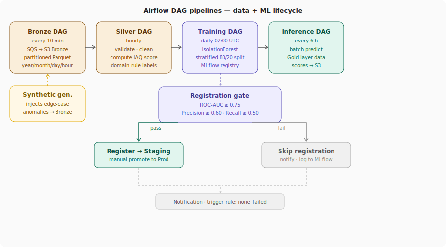

# IoT MLOps Platform — Air Quality Anomaly Detection

> End-to-end MLOps platform built on a real **Raspberry Pi 3** with a BME680 sensor. Sensor readings flow from the edge through a Bronze/Silver/Gold S3 data lake, into an Airflow-orchestrated training pipeline, and are served as real-time anomaly detection via AWS Lambda. The entire cloud infrastructure runs on EKS, provisioned with Terraform and deployed via ArgoCD GitOps.
>
> This is the portfolio meta-repo. Each layer of the system lives in its own repository — links and descriptions below.

---

## Architecture overview

---

## The core challenge: sparse edge data

> **Problem:** A single Raspberry Pi running 24/7 produces nearly uniform readings — natural anomalies are rare, so a naively trained model just learns *"everything is normal."*

**Solution — synthetic anomaly injection:**

| What | How |
|------|-----|
| 🧪 Inject anomalies | `generator/` writes edge-case readings (gas spikes, temp/humidity excursions) directly into Bronze |
| 🏷️ Label with domain rules | IAQ score, temperature `[28–33 °C]`, humidity `[60–70 %]` thresholds — not blind clustering |
| 📐 Set contamination | Derived from observed anomaly rate — no manual guesswork |

Result: the model learns a meaningful decision boundary even with a single physical device.

---

## Repositories

### 🔌 [`iot-mlops-edge-compute`](https://github.com/TranNguyenPhucAnh/iot-mlops-edge-compute)

Edge data collection agent running on the Raspberry Pi.

| File | What it does |
|------|-------------|
| `collector.py` | Reads BME680 every 10 s, batches 10 readings, publishes to SQS. Retry logic, graceful shutdown, local backup for offline buffering. Calls inference API after each successful batch. |
| `fluent-bit.conf` | Ships structured JSON stdout logs to Grafana Loki |
| `deploy_collector.yml` | Ansible playbook for zero-touch deployment to the Pi |
| `Jenkinsfile` | Builds and pushes Docker image to ECR via Jenkins on EKS |

Full **OpenTelemetry** instrumentation — every span (sensor init, read, SQS send, inference call) exported to Grafana Tempo via OTLP. **Node Exporter** exposes host metrics (CPU, memory, disk) to Prometheus.

---

### 🐍 [`iot-mlops-python-dag`](https://github.com/TranNguyenPhucAnh/iot-mlops-python-dag)

All Python workloads: Airflow DAGs, synthetic data generator, Lambda function, and ArgoCD Image Updater scripts.

**Airflow DAGs — 4 pipelines:**

| DAG | Schedule | What it does |
|-----|----------|-------------|
| `iot_ml_bronze_pipeline` | Every 10 min | Drains SQS → partitioned Parquet to S3 Bronze |
| `iot_ml_silver_pipeline` | Hourly | Validates, cleans, computes IAQ score → S3 Silver |
| `iot_ml_training_pipeline` | Daily 02:00 UTC | Silver → Isolation Forest → MLflow registry |
| `iot_ml_inference_pipeline` | Every 6 h | Batch inference on Gold layer → anomaly scores to S3 |

**Training pipeline detail (`iot_ml_training_pipeline.py`):**

- Loads last 7 days of Silver data, logs sensor range stats for threshold tuning
- Labels records via domain rules: IAQ score, temperature `[28–33 °C]`, humidity `[60–70 %]`
- Stratified 80/20 train/test split — guarantees anomalies appear in both sets
- Trains `IsolationForest` with `contamination` = observed anomaly rate
- Registers to MLflow **Staging** only if all three gates pass:

  | Metric | Threshold |
  |--------|-----------|
  | ROC-AUC | ≥ 0.75 |
  | Precision | ≥ 0.60 |
  | Recall | ≥ 0.50 |

- Logs confusion matrix, `label_thresholds.json`, and scaler artifact to MLflow
- Exports `model.pkl` + `scaler.pkl` to `s3://…/models/latest/` for Lambda

**Other components:**

| Directory | Role |
|-----------|------|
| `generator/` | Synthetic anomaly injector for Bronze layer |
| `lambda/` | Inference handler — scores a reading, returns `is_anomaly`, `decision_score`, `anomaly_type`, `severity`, `iaq_score` |
| `image_updater/` | ArgoCD Image Updater integration scripts |
| `tests/` | Unit tests for DAG tasks and Lambda handler |

---

### ☸️ [`iot-mlops-manifests`](https://github.com/TranNguyenPhucAnh/iot-mlops-manifests)

Kubernetes manifests and ArgoCD Application definitions for all EKS workloads.

| Directory | What runs there |
|-----------|----------------|
| `airflow-app/` | Airflow (CeleryExecutor), DAG sync from S3 |
| `mlflow-app/` | MLflow tracking server — RDS PostgreSQL + S3 artifacts |
| `grafana-app/` | Grafana with Alloy, forwarding to Grafana Cloud |
| `jenkins-app/` | Jenkins with EBS-backed persistent workspace |
| `apps/` | ArgoCD Application CRDs + Image Updater annotations |

ArgoCD Image Updater watches ECR and automatically bumps image tags in this repo when Jenkins pushes a new build — **the GitOps loop closes without manual commits**.

---

### 🏗️ [`iot-mlops-terraform`](https://github.com/TranNguyenPhucAnh/iot-mlops-terraform)

Modular Terraform for the entire AWS foundation.

| Module | Resources |
|--------|-----------|
| `networking` | VPC, public/private subnets, IGW, NAT gateway, route tables |
| `eks` | EKS cluster, node groups, IRSA roles |
| `rds` | RDS PostgreSQL (Airflow + MLflow metadata) |
| `s3` | Data lake bucket (Bronze/Silver/Gold), model artifacts |
| `iam` | Least-privilege roles for EKS workloads via IRSA |
| `observability` | SSM parameters, Grafana Alloy config, alert routing |

---

## How to navigate this project

| If you want to see... | Start here |
|---|---|
| 🔌 Edge data collection | [`collector.py`](https://github.com/TranNguyenPhucAnh/iot-mlops-edge-compute/blob/main/collector.py) |
| 🪣 Data lake pipelines | [`iot_ml_bronze_pipeline.py`](https://github.com/TranNguyenPhucAnh/iot-mlops-python-dag/blob/main/iot_ml_bronze_pipeline.py) |
| 🧠 ML training + MLflow | [`iot_ml_training_pipeline.py`](https://github.com/TranNguyenPhucAnh/iot-mlops-python-dag/blob/main/iot_ml_training_pipeline.py) |
| ⚡ Real-time inference | [`lambda/`](https://github.com/TranNguyenPhucAnh/iot-mlops-python-dag/tree/main/lambda) |
| ☸️ Kubernetes workloads | [`iot-mlops-manifests/`](https://github.com/TranNguyenPhucAnh/iot-mlops-manifests) |
| 🏗️ AWS infrastructure | [`iot-mlops-terraform/`](https://github.com/TranNguyenPhucAnh/iot-mlops-terraform) |

---

## Tech stack

**🔌 Edge**

**☁️ Cloud — data**

**⚙️ Cloud — compute**

**🧠 MLOps**

**🏗️ Infrastructure**

**📊 Observability**

---

## Design decisions note

| Decision | Why it matters |
|----------|---------------|
| 🔍 **SSM for endpoint discovery** | The Pi fetches the Lambda URL from SSM at startup — Terraform writes it post-provisioning, the Pi only needs `ssm:GetParameter`. URL can change without touching edge code. |
| 🏷️ **Domain-rule labels** | IAQ score + sensor bounds label records before training, giving Isolation Forest a meaningful `contamination` value and making ROC-AUC/Precision/Recall interpretable — something pure unsupervised labeling cannot provide. |
| 📊 **Stratified over time-based split** | With a single sensor, anomalies cluster in time — a naïve 80/20 time split can leave the test set with zero anomalies. Stratified split guarantees representation in both sets. |
| 🔐 **IRSA everywhere** | No long-lived AWS credentials anywhere. All EKS workloads use IAM Roles for Service Accounts — ephemeral, automatically rotated, least-privilege. |
