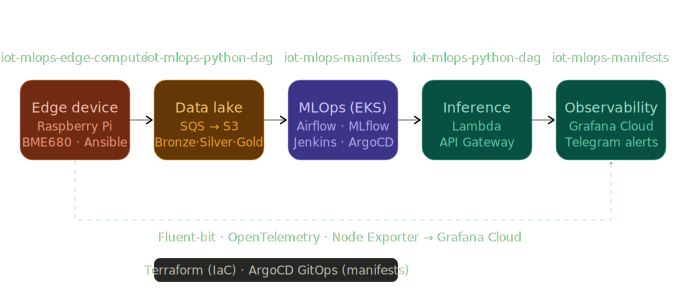
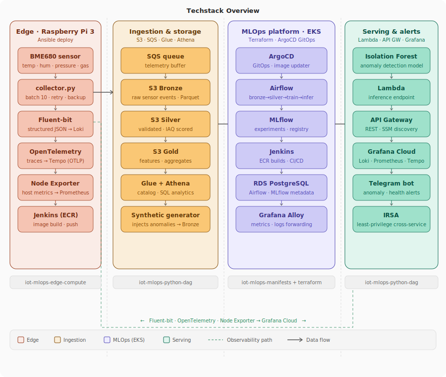

# IoT MLOps Platform — Air Quality Anomaly Detection

End-to-end MLOps platform built on a real Raspberry Pi 3 with a BME680 sensor.
Sensor readings flow from the edge through a Bronze/Silver/Gold S3 data lake, into
an Airflow-orchestrated training pipeline, and are served as real-time anomaly
detection via AWS Lambda. The entire cloud infrastructure runs on EKS, provisioned
with Terraform and deployed via ArgoCD GitOps.

> This is the portfolio meta-repo. Each layer of the system lives in its own
> repository — links and descriptions below.

---

## Architecture overview

---

## The core challenge: sparse edge data

A single Raspberry Pi running 24/7 produces roughly uniform sensor readings —
nearly no natural anomalies occur day-to-day. Training an Isolation Forest on
that data alone yields a model that learns "everything is normal."

The solution was a **synthetic anomaly generator** (`generator/` in
`iot-mlops-python-dag`) that injects realistic edge-case readings directly into
the Bronze layer: gas resistance spikes simulating air quality events, temperature
and humidity excursions outside the defined domain thresholds. The training DAG
then labels records using domain rules (IAQ score, temperature, humidity bounds)
and sets `contamination` directly from the observed anomaly rate — no guesswork.

This approach lets the model learn a meaningful decision boundary even with a
single physical device generating data.

---

## Repositories

### [`iot-mlops-edge-compute`](https://github.com/TranNguyenPhucAnh/iot-mlops-edge-compute)

Edge data collection agent running on the Raspberry Pi.

- `collector.py` — reads BME680 (temperature, humidity, pressure, gas resistance)
  every 10 s, batches 10 readings, and publishes to AWS SQS. Includes retry logic,
  graceful shutdown, and a local backup file for offline buffering.
- On each successful batch, calls the inference API (endpoint discovered from SSM
  Parameter Store at startup) for real-time anomaly scoring.
- Full OpenTelemetry instrumentation — every span (sensor init, read, SQS send,
  inference call) is exported to Grafana Tempo via OTLP.
- Fluent-bit ships structured JSON stdout logs to Grafana Loki.
- Node Exporter exposes host metrics (CPU, memory, disk) to Prometheus.
- `deploy_collector.yml` — Ansible playbook for zero-touch deployment to the Pi.
- `Jenkinsfile` — builds and pushes the Docker image to ECR via Jenkins on EKS.

### [`iot-mlops-python-dag`](https://github.com/TranNguyenPhucAnh/iot-mlops-python-dag)

All Python workloads: Airflow DAGs, the synthetic data generator, Lambda function,
and ArgoCD Image Updater scripts.

**Airflow DAGs (4 pipelines):**

| DAG | Schedule | What it does |
|-----|----------|--------------|
| `iot_ml_bronze_pipeline` | Every 10 min | Drains SQS → writes partitioned Parquet to S3 Bronze |
| `iot_ml_silver_pipeline` | Hourly | Validates, cleans, computes IAQ score → S3 Silver |
| `iot_ml_training_pipeline` | Daily 02:00 UTC | Silver → Isolation Forest → MLflow registry |
| `iot_ml_inference_pipeline` | Every 6 h | Batch inference on Gold layer → anomaly scores to S3 |

**Training pipeline detail (`iot_ml_training_pipeline.py`):**
- Loads last 7 days of Silver data from S3, logs sensor range stats
- Labels records using domain rules: IAQ score, temperature `[28–33°C]`,
  humidity `[60–70%]`
- Stratified 80/20 train/test split — ensures anomalies appear in both sets
- Trains `IsolationForest` with `contamination` = observed anomaly rate
- Evaluates ROC-AUC, Precision, Recall — registers to MLflow Staging only if all
  three thresholds pass (`ROC-AUC ≥ 0.75`, `Precision ≥ 0.60`, `Recall ≥ 0.50`)
- Logs confusion matrix, `label_thresholds.json`, and scaler artifact to MLflow
- Exports `model.pkl` + `scaler.pkl` to `s3://…/models/latest/` for Lambda

**Other components:**
- `generator/` — synthetic anomaly injector for Bronze layer
- `lambda/` — Lambda handler: loads model/scaler from S3, scores a reading,
  returns `is_anomaly`, `decision_score`, `anomaly_type`, `severity`, `iaq_score`
- `image_updater/` — ArgoCD Image Updater integration scripts
- `tests/` — unit tests for DAG tasks and Lambda handler

### [`iot-mlops-manifests`](https://github.com/TranNguyenPhucAnh/iot-mlops-manifests)

Kubernetes manifests and ArgoCD Application definitions for all EKS workloads.

- `airflow-app/` — Airflow on Kubernetes (KubernetesExecutor), DAG sync from S3
- `mlflow-app/` — MLflow tracking server backed by RDS PostgreSQL + S3 artifacts
- `grafana-app/` — Grafana with Alloy for metrics/log forwarding to Grafana Cloud
- `jenkins-app/` — Jenkins with EBS-backed persistent workspace
- `apps/` — ArgoCD Application CRDs and Image Updater annotations

ArgoCD Image Updater watches ECR and automatically bumps image tags in this repo
when Jenkins pushes a new build — GitOps loop closes without manual commits.

### [`iot-mlops-terraform`](https://github.com/TranNguyenPhucAnh/iot-mlops-terraform)

Modular Terraform for the entire AWS foundation.

| Module | Resources |
|--------|-----------|
| `networking` | VPC, public/private subnets, IGW, NAT gateway, route tables |
| `eks` | EKS cluster, node groups, IRSA roles |
| `rds` | RDS PostgreSQL (Airflow + MLflow metadata) |
| `s3` | Data lake bucket (Bronze/Silver/Gold), model artifacts bucket |
| `iam` | Least-privilege roles for EKS workloads via IRSA |
| `observability` | SSM parameters, Grafana Alloy config, alert routing |

---

## How to navigate this project

Start here if you want to understand a specific part:

1. **Edge data collection** → [`iot-mlops-edge-compute/collector.py`](https://github.com/TranNguyenPhucAnh/iot-mlops-edge-compute/blob/main/collector.py)
2. **Data lake pipelines** → [`iot-mlops-python-dag/iot_ml_bronze_pipeline.py`](https://github.com/TranNguyenPhucAnh/iot-mlops-python-dag/blob/main/iot_ml_bronze_pipeline.py)
3. **ML training + MLflow** → [`iot-mlops-python-dag/iot_ml_training_pipeline.py`](https://github.com/TranNguyenPhucAnh/iot-mlops-python-dag/blob/main/iot_ml_training_pipeline.py)
4. **Real-time inference** → [`iot-mlops-python-dag/lambda/`](https://github.com/TranNguyenPhucAnh/iot-mlops-python-dag/tree/main/lambda)
5. **Kubernetes workloads** → [`iot-mlops-manifests/`](https://github.com/TranNguyenPhucAnh/iot-mlops-manifests)
6. **AWS infrastructure** → [`iot-mlops-terraform/`](https://github.com/TranNguyenPhucAnh/iot-mlops-terraform)

---

## Tech stack

**Edge:** Python · Adafruit BME680 · OpenTelemetry · Fluent-bit · Node Exporter · Docker · Ansible

**Cloud — data:** AWS SQS · S3 · Glue Data Catalog · Amazon Athena

**Cloud — compute:** AWS EKS · Lambda · API Gateway · ECR · RDS PostgreSQL · SSM Parameter Store

**MLOps:** Apache Airflow · MLflow · scikit-learn (IsolationForest) · Jenkins

**Infrastructure:** Terraform · ArgoCD · ArgoCD Image Updater · IRSA

**Observability:** Grafana Cloud · Grafana Alloy · Loki · Prometheus · Tempo · Telegram Bot

---

## Design decisions worth noting

**SSM Parameter Store for endpoint discovery** — the Raspberry Pi discovers the
Lambda inference URL from SSM at startup rather than hardcoding it. Terraform
writes the endpoint after provisioning; the Pi only needs `ssm:GetParameter`
permission. No Terraform knowledge required on the device.

**Domain-rule labels, not unsupervised only** — IAQ score thresholds and
sensor range bounds derived from 7-day rolling stats label each record before
training. This gives the Isolation Forest a meaningful `contamination` value and
makes evaluation metrics (ROC-AUC, Precision, Recall) interpretable.

**Stratified split over time-based split** — with a single-sensor dataset,
anomalies cluster in time. A naive time-based 80/20 split can leave the test set
with zero anomalies. Stratified split guarantees anomaly representation in both
sets regardless of when they occurred.

**IRSA everywhere** — no long-lived AWS credentials anywhere. Every EKS workload
(Airflow, MLflow, Jenkins, Grafana Alloy) uses IAM Roles for Service Accounts
with the minimum required permissions.
